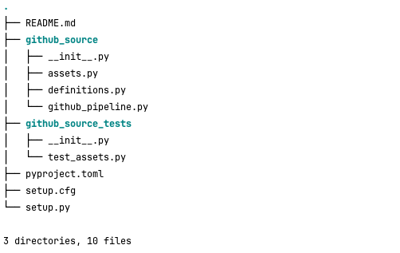
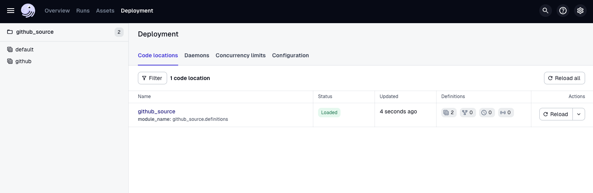
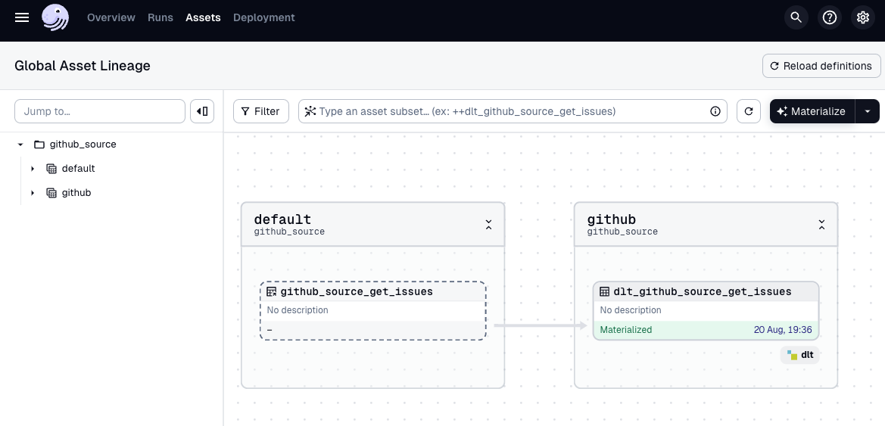
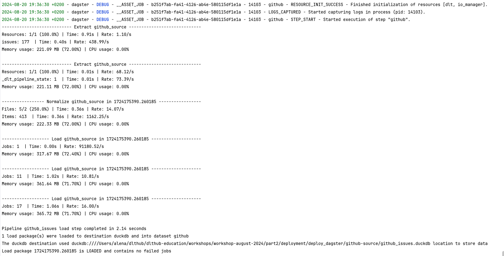

# Dagster

## Introduction to Dagster

Dagster is an orchestrator designed for developing and maintaining data assets, such as tables, data sets, machine learning models, and reports. Dagster ensures these processes are reliable and focuses on using software-defined assets (SDAs) to simplify complex data management, enhance the ability to reuse code, and provide a better understanding of data.

To read more, please refer to Dagster’s [documentation.](https://docs.dagster.io/getting-started?_gl=1*19ikq9*_ga*NTMwNTUxNDAzLjE3MDg5Mjc4OTk.*_ga_84VRQZG7TV*MTcwOTkwNDY3MS4zLjEuMTcwOTkwNTYzNi41Ny4wLjA.*_gcl_au*OTM3OTU1ODMwLjE3MDg5Mjc5MDA.)

## Install

Install Dagster and the embedded ELT package using pip:

```sh
pip install dagster dagster-embedded-elt
```

## Set up Dagster directory structure

Create the Dagster project structure:

```bash
dagster project scaffold --name github-source

```



## Add dlt pipeline to `github_source`

In your Dagster project, define the dlt pipeline in `github_source` folder. 

**Note**: That dlt Dagster helper works only with dlt source. Your resources always should be grouped in a source.

```python
import dlt
...
@dlt.resource(
    table_name="issues",
    write_disposition="merge",
    primary_key="id",
)
def get_issues(
        updated_at=dlt.sources.incremental("updated_at", initial_value="1970-01-01T00:00:00Z")
):
    url = (
        f"{BASE_URL}?since={updated_at.last_value}&per_page=100&sort=updated"
        "&directions=desc&state=open"
    )
    yield pagination(url)
    
@dlt.source
def github_source():
    return get_issues()

```

## Assets: **Create a dlt_assets definition**

The [**`@dlt_assets`**](https://docs.dagster.io/_apidocs/libraries/dagster-embedded-elt#dagster_embedded_elt.dlt.dlt_assets) decorator takes a **`dlt_source`** and **`dlt_pipeline`** parameter. In this example, we used the `github_source` source and created a **`dlt_pipeline`** to ingest data from Github to DuckDB.

Here’s an example of how to define assets (`github_source/assets.py`): 

```python
from dagster import AssetExecutionContext
from dagster_embedded_elt.dlt import DagsterDltResource, dlt_assets
from dlt import pipeline
from .github_pipeline import github_source

@dlt_assets(
    dlt_source=github_source(),
    dlt_pipeline=pipeline(
        pipeline_name="github_issues",
        dataset_name="github",
        destination="duckdb",
        progress="log",
    ),
    name="github",
    group_name="github",
)
def dagster_github_assets(context: AssetExecutionContext, dlt: DagsterDltResource):
    yield from dlt.run(context=context)
```

## **Create the Definitions object**

The last step is to include the assets and resource in a [Definitions](https://docs.dagster.io/_apidocs/definitions#dagster.Definitions) object (`github_source/definitions.py`). This enables Dagster tools to load everything we've defined:

```py
from dagster import Definitions, load_assets_from_modules
from dagster_embedded_elt.dlt import DagsterDltResource
from . import assets

dlt_resource = DagsterDltResource()
all_assets = load_assets_from_modules([assets])

defs = Definitions(
    assets=all_assets,
    resources={
        "dlt": dlt_resource,
    },
)
```

## Run Web server locally

1. Install the necessary dependencies using the following command:
    
    ```bash
    pip install -e ".[dev]"
    ```
    
    We use `-e` to install dependencies in [editable mode](https://pip.pypa.io/en/latest/topics/local-project-installs/#editable-installs). This allows changes to be automatically applied when we modify the code.
    
2. Run the project:
    
    ```bash
    dagster dev
    ```
    
3. Navigate to `localhost:3000` in your web browser to access the Dagster UI.
    
    

## Run the pipeline

You should now have a running instance of Dagster! From here, we can run our data pipeline.

To run the pipeline, go to **Assets** and click the **Materialize** button in the top right. In Dagster, *materialization* refers to executing the code associated with an asset to produce an output.



You will see logs in your command line:



Want to see real-world examples of dlt in production? Check out how to use it internally at Dagster in the [Dagster Open Platform](https://github.com/dagster-io/dagster-open-platform) project.

## Deploy on Dagster Cloud

The easiest way to deploy your Dagster project is to use Dagster Cloud.

Check out the [Dagster Cloud Documentation](https://docs.dagster.cloud) to learn more.

## What is next?

- [Schedule your pipeline](https://docs.dagster.io/tutorial/scheduling-your-pipeline)
- [Customize dlt assets](https://docs.dagster.io/integrations/embedded-elt/dlt#overriding-the-translator-to-customize-dlt-assets)
- [Assign metadata to upstream source assets](https://docs.dagster.io/integrations/embedded-elt/dlt#assigning-metadata-to-upstream-source-assets)