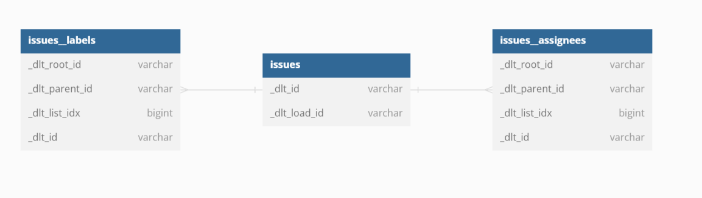
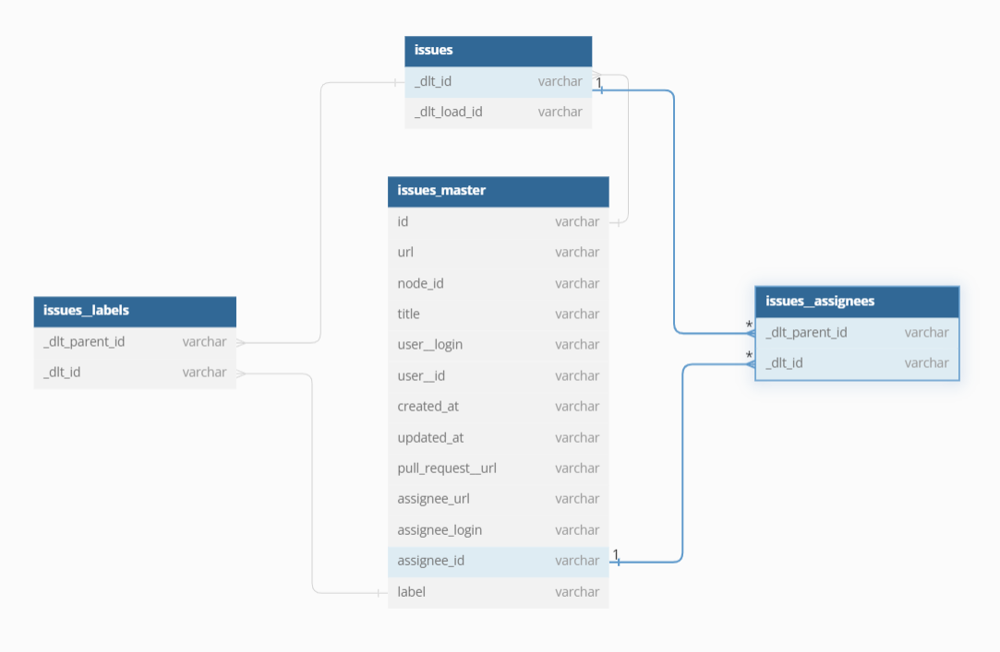

# Using `dlt`'s dbt runner!

The combination of dlt and dbt (via the dbt runner) provides a powerful and flexible solution for data loading and transformation! This combination offers end-to-end cross-database compatibility. This feature allows you to load data from a variety of sources into your database using dlt, and then transform it using dbt, irrespective of the database type.

## Here are the steps to replicate this project:

1. **Installation**: 
   - Install `dlt[duckdb]` if you haven't already: `pip install dlt[duckdb]`
   - Install `dbt` with `duckdb` support: `pip install dbt-duckdb`
2. **Create the pipeline**: create the pipeline you'd like to eventually modify. 
   - This can be found in `ingestion.py`. 
   - The pipeline created is of GitHub issues.  
3. **Optional step**: create a file to be able to directly query your destination if needed. I wanted to have a CMD interface to query the `duckdb` destination; this is the purpose of `query.py`.
4. **Initiate the dbt project**: Run `dbt init workshop_demo`
5. **Transform**: Add the transformations you'd like to the dbt project.
   - Create the schema in YAML file for the tables you'd like to add/model. In this project, we'll be creating a master table for the issues. It can be found in `workshop_demo/models/schema.yaml`. 
   - The original model looks like this:
   
   - The master table we want to create would look like this:
   
   - To add the query for this model, place it in the `models` folder. Here, it is `workshop_demo/models`.
6. Now that we have added our dbt model(s). We can create a new dataset in our destination to hold these transformed tables, and run our dbt models. In this project, this can be found in `modeling.py`. 

# Learn More
Learn more about how you can take your dlt+dbt pipelines into production [here](https://dlthub.com/blog/dlt-motherduck-demo)!