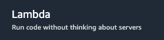

# Deploy with Lambda function

Deploying a Python script as an AWS Lambda function is a common task for running serverless applications or automating tasks in the cloud. Here's a step-by-step guide on how to do it:
