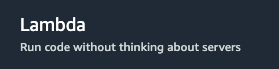
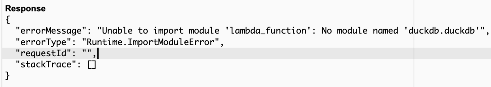

# AWS Lambda Function




AWS Lambda is a serverless compute service that lets you run code without provisioning or managing servers. You simply upload your code, and Lambda handles everything required to run and scale your code with high availability. Lambda functions are event-driven, meaning they can be triggered by various AWS services or external events, such as HTTP requests via API Gateway or file uploads to S3. This makes Lambda an ideal solution for building microservices, automating tasks, or responding to real-time data processing needs.

Deploying a Python script as an AWS Lambda function is a common task for running serverless applications or automating tasks in the cloud.
This guide will walk you through the steps required to deploy a Python script using dlt (data load tool) on AWS Lambda. The guide covers creating a Lambda layer with Docker on an AMD64 architecture machine and then running the dlt pipeline in AWS Lambda.


## Prerequisites

1. **AWS Account**: Ensure you have an active AWS account.
2. **Python**: Ensure you have Python installed locally to create and test your script.
3. **dlt Package**: Install the dlt Python package locally for development purposes.
4. **(Optional) Docker**: Install Docker on your local machine.

## Summary:

1. Create Lambda function
2. Add dlt pipeline script
3. Configure lambda function
4. Create layer with dependencies
5. Test

## 1. Create Lambda Function

### Step 1: Prepare your dlt pipeline script

Create a Python script that utilizes the dlt package. 

```python
def lambda_handler(event, context):
    import dlt
    ....
    pipeline = dlt.pipeline(
        pipeline_name="github_issues_merge",
        destination="duckdb",
        dataset_name="github_data_merge",
    )

    load_info = pipeline.run(get_issues())
    print(pipeline.last_trace.last_normalize_info)
    print(load_info)

    return load_info
```

### Step 2: Log in to the AWS Management Console

1. **Log in** to your AWS account at [AWS Management Console](https://aws.amazon.com/console/).
2. **Navigate to Lambda**:
    - In the search bar at the top, type **Lambda** and select **Lambda** under the “Compute” category.

### Step 3: Create a New Lambda Function

1. **Click "Create function"**:
    - On the Lambda dashboard, click the **Create function** button.
2. **Choose an Authoring Method**:
    - Select **Author from scratch**.
3. **Configure the Basic Settings**:
    - **Function name**: Enter a name for your function, such as `my_python_lambda`.
    - **Runtime**: Choose the Python runtime that matches your script, e.g., `Python 3.12`.
    - **Role**: Choose or create a new role with basic Lambda permissions:
        - **Create a new role with basic Lambda permissions** is often the easiest option if you're unsure.
4. **Click "Create function"**:
    - This will create your Lambda function and take you to the function configuration page.

## 2. Add dlt pipeline script

### Step 1: Add dlt pipeline script

1. **Edit the Code Inline**:
    - In the **Code source** section, you’ll see an inline editor where you can write or paste your Python script.
2. **Upload a .zip File (if your script has dependencies)**:
    - If your script is standalone, you can paste it directly into the editor.
    - If your script has dependencies, you'll need to zip the script and the dependencies together and upload the zip file:
        1. Prepare your script and dependencies.
        2. Compress them into a `.zip` file.
        3. In the **Code source** section, click **Upload from** and select **.zip file**.
        4. Upload your zipped file.

### Step 2: Set the Handler Name

1. **Handler Name**:
    - Ensure the handler is correctly set to `lambda_function.lambda_handler`:
        - `lambda_function` refers to the file name `lambda_function.py`.
        - `lambda_handler` refers to the function inside the script that AWS Lambda will invoke.
2. **Save**:
    - After editing the code or uploading your file, click **Deploy** to save your changes.

## 3. Configure the Lambda Function

### **Step1: Set Environment Variables**

- Set follows ENVs in **Configuration → Environment variables**:
    - DLT_DATA_DIR=/tmp
    - DESTINATION__DUCKDB__CREDENTIALS=duckdb:////tmp/github_issues_merge.duckdb

### **Step 2: Increase Memory and Timeout**

- Adjust the memory and timeout settings according to your script's needs under: **Configuration → General configuration → Edit → Timeout/Memory**

## 4. Create the layer with dependencies: dlt, duckdb

### Step 1: Set Up a Docker Environment for `arm64`

I have a MacBook with arm64 architecture and tried to create a layer on it. Unfortunately, AWS Lambda supports arm64, but only for linux. Some python packages are cross-platform, such as dlt, and are OS independent, but in our case, duckdb was not found as a module.



If you have a different architecture or OS and you believe your configuration is compatible with AWS Lambda, you can skip all the Docker manipulations and create the layer locally on your machine.

The easiest way to ensure that your dependencies are compatible with the `linux/arm64` architecture is to build them in an `linux/arm64` environment. Docker can simulate this environment on your local machine.

1. **Install Docker** if you don’t already have it.
2. **Pull an `arm64` Python Docker Image**:
    
    Pull a Docker image that matches the Python runtime you plan to use for your Lambda function (e.g., `python:3.12`):
    
    ```bash
    docker pull --platform linux/arm64 python:3.12
    
    ```
    
3. **Run the Docker Container**:
    
    Start a Docker container with the `arm64` platform:
    
    ```bash
    docker run -it --platform linux/arm64 --name lambda-linux-arm64 python:3.12 /bin/bash
    ```
    
    This opens a bash shell inside the container.
    

### Step 2: Install Dependencies in the Docker Container

1. **Create a Directory for the Layer**:
    
    Inside the Docker container, create a directory for your Python packages:
    
    ```bash
    mkdir -p /opt/python
    ```
    
2. **Install Python Packages**:
    
    Use `pip` to install the necessary packages into the `/opt/python` directory:
    
    ```bash
    pip install dlt -t /opt/python
    ```
    
    and
    
    ```bash
    pip install duckdb -t /opt/python
    ```
    
    This command installs the package and its dependencies into the `/opt/python` directory, which is required for Lambda layers.
    
3. **Verify the Installation**:
    
    Ensure that the packages are installed in the `/opt/python` directory:
    
    ```bash
    ls /opt/python
    ```
    
    You should see the installed packages listed here.
    

### Step 3: Package the Layer

1. **Exit the Docker Container**:
    
    Exit the Docker container:
    
    ```bash
    exit
    ```
    
2. **Copy the Files from Docker to Your Local Machine**:
    
    Copy the `/opt/python` directory from the Docker container to your local machine:
    
    ```bash
    docker cp lambda-linux-arm64:/opt/python ./python
    ```
    
3. **Create a Zip File**:
    
    Zip the `python` directory on your local machine:
    
    ```bash
    
    zip -r9 lambda_layer_arm64.zip python
    
    ```
    
    This creates a `lambda_layer_arm64.zip` file that contains all the necessary dependencies for your Lambda layer.
    

### Step 4: Create the Lambda Layer in AWS

1. **Log in to the AWS Management Console**:
    
    Go to the [AWS Management Console](https://aws.amazon.com/console/) and log in to your account.
    
2. **Navigate to the Lambda Service**:
    
    In the AWS Management Console, search for **Lambda** and select **Layers**.
    
3. **Create a New Layer**:
    - Click on **Create layer**.
    - **Name**: Give your layer a name, like `dlt-duckdb-linux-arm64`.
    - **Description**: Optionally, add a description.
    - **Upload the Zip File**: Upload the `lambda_layer_arm64.zip` file you created.
    - **Compatible Runtimes**: Select the Python runtime(s) that your layer is compatible with (e.g., Python 3.12).
    - **Architecture**: Make sure to select `arm64`.
4. **Create the Layer**:
    
    Click **Create** to create the Lambda layer.
    

### Step 5: Attach the Layer to your Lambda Function

1. **Go to your Lambda Function**:
    
    In the Lambda console, navigate to the function where you want to use this layer.
    
2. **Add the Layer**:
    - Scroll down to the **Layers** section.
    - Click **Add a layer**.
    - Choose **Custom layers** and select the layer you just created.
    - Click **Add** to attach the layer to your Lambda function.
3. **Set the Architecture**:
    
    Ensure that your Lambda function is set to use the `arm64` architecture:
    
    - In the **Basic settings** section of your Lambda function configuration, set the architecture to `arm64`.
4. **Deploy and Test**:
    
    Save your changes, deploy the function, and test it to ensure that everything works as expected.
    

## 5. Test your Lambda Function

1. **Create a Test Event**:
    - Click the **Test** button.
    - Create a new test event with a sample payload (this is just a sample JSON input your function might expect).
    
    Example:
    
    ```json
    {
        "key1": "value1",
        "key2": "value2",
        "key3": "value3"
    }
    ```
    
2. **Run the Test**:
    - After configuring the test event, click **Test** again to invoke the Lambda function with this test data.
3. **View the Results**:
    - The output of your function, including any return values and log outputs, will be displayed.